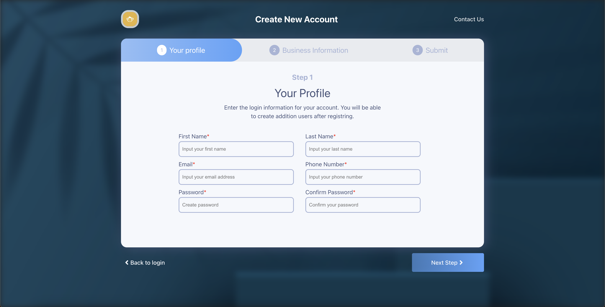
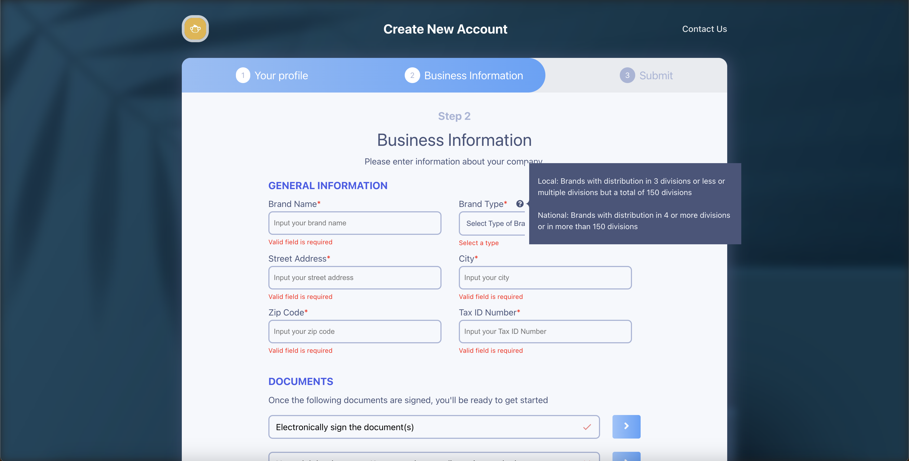

# Multistep Registration Form
# Table of Contents
- [Multistep Registration Form](#multistep-registration-form)
- [Table of Contents](#table-of-contents)
- [Introduction](#introduction)
  - [Getting Started](#getting-started)
    - [Install the dependencies](#install-the-dependencies)
    - [Development](#development)
    - [Build](#build)
  - [Contribution](#contribution)


> *Note*: This is just a frontend project. You can customize the form as you need.
>
> You can also give me a star if you find it useful.  

# Introduction
This project was inspired by the design of [Ivan Poddubchenko](https://dribbble.com/shots/6792188-Registration-Form). It is a multistep registration form build with [Vite-React](https://vitejs.dev/guide/).

| Step 1 | Step 2 |
|--------|-------|
|  |  |

## Getting Started
To get started, clone or fork the repo. You will need to have npm or yarn.

### Install the dependencies
npm:
```npm
npm install
```

Yarn:
```Yarn
yarn install
```

### Development
To spin the server, run the following command.
```npm
npm run dev
```
### Build
Ready to go to production? Run:
```npm
npm run build
```
## Contribution
You can do whatever you want with this project. 
Find it awesome? Give me a star.